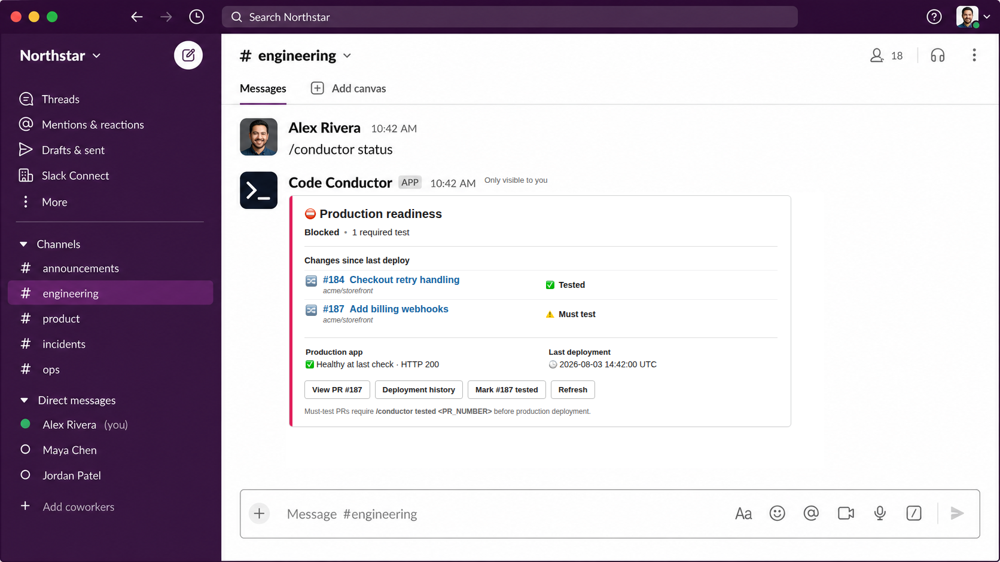
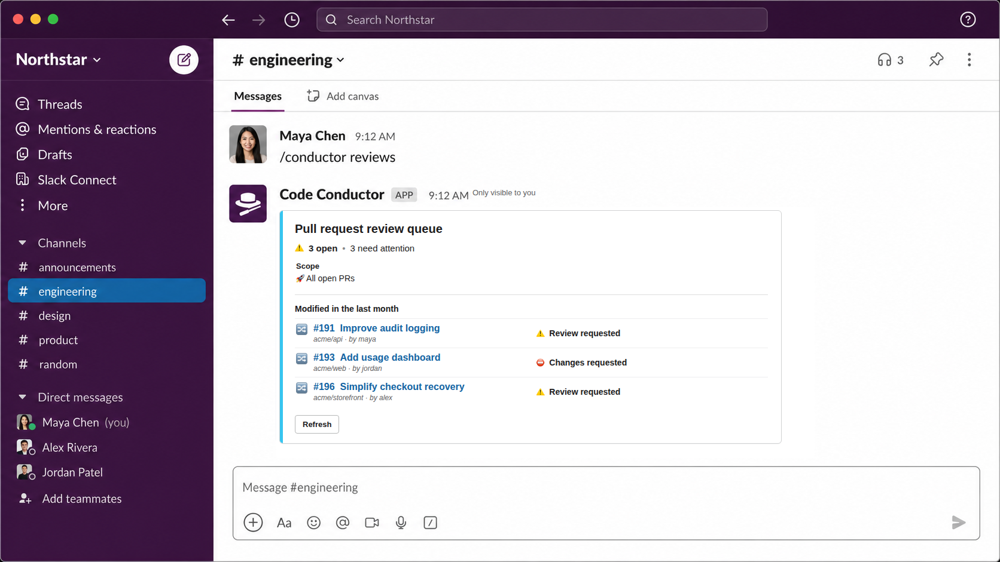
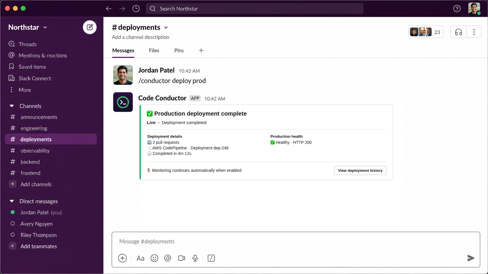

# Code Conductor

**Your team's command center from pull request to production.**

[](https://github.com/willakins/code-conductor/actions/workflows/ci.yml)


Code Conductor is a self-hosted engineering operations bot that keeps a team aligned on what has
been reviewed, tested, deployed, and is healthy in production. It connects chat, code-hosting,
deployment, monitoring, and support systems behind one auditable workflow—without replacing the
tools your team already uses.

<p align="center">
  
</p>

<p align="center"><sub>Representative Slack rendering of the current Block Kit structure with fictional workspace data.</sub></p>

## Why Code Conductor?

Engineering status is usually scattered across pull requests, chat threads, CI/CD dashboards, and
monitoring tools. Code Conductor turns those disconnected signals into a shared operating picture:

- **Coordinate reviews** — see which open PRs need attention and send scheduled review recaps.
- **Track delivery state** — follow merged changes through explicit testing and production deployment.
- **Protect production** — enforce audited gates and required-test rules before a deploy can proceed.
- **Automate deployments** — trigger staging or production delivery and report completion back in chat.
- **Watch runtime health** — post outage, recovery, and newly regressed error alerts where the team works.
- **Keep operations moving** — track support mail, assign on-call ownership, and draft replies with an optional AI provider.

## See It in Action

### Keep reviews moving

Ask for the review queue or let Code Conductor post a scheduled recap. Review state is reconciled
from the active code host so the team can see where attention is needed without leaving chat.



### Make readiness visible

Code Conductor combines deployment gates, required tests, merged changes, deployment history, and
current application health into one operational status.


### Deploy and keep watching

Authorized teammates can launch a deployment from chat. Code Conductor follows the provider to
completion, records the result atomically, announces what shipped, and continues monitoring health.



> [!NOTE]
> The screenshots mirror the fields, actions, visibility, two-column layout, and tone accents emitted
> by the current Block Kit renderer. Slack controls final typography and spacing, while message content
> varies with live provider and database state.

## One Workflow, Pluggable Providers

| Capability | Supported providers |
| --- | --- |
| Team communication | Slack, Microsoft Teams |
| Code hosting | GitHub, Bitbucket |
| Deployment | DigitalOcean App Platform, AWS CodePipeline |
| Error tracking | Sentry, Rollbar |
| Support email | Gmail, Outlook |
| AI-assisted drafts | OpenAI, Anthropic |
| Persistence | PostgreSQL |

The default stack is Slack + GitHub + DigitalOcean, but provider selection is runtime-configurable
and unknown providers fail fast at startup.

## Delivery Workflow

```text
Open PR → review state → merge → testing confirmation → deployment gate → deploy → health monitoring
```

The primary Slack command is `/conductor`; the original `/calypso` command remains registered as a
compatibility alias for existing installations.

Common commands:

```text
/conductor reviews
/conductor status
/conductor tested <PR_NUMBER>
/conductor gate status
/conductor deploy prod
/conductor history
/conductor doctor
```

## Reliability by Design

- Webhook signatures are verified before payload processing.
- Only the configured repository and main branch are ingested.
- A blocked deployment cannot pass through the normal deploy path.
- Failed provider calls do not create deployment records or mark PRs as deployed.
- Deployment insertion and PR state transitions share one PostgreSQL transaction.
- Gate changes, testing confirmations, and deployment runs remain auditable.

## Architecture

Code Conductor is a single Node.js service composed of:

- Communication platform provider (Slack implemented; Microsoft Teams implemented).
- Code-host platform provider (GitHub implemented; Bitbucket implemented).
- Deploy platform provider (DigitalOcean implemented; AWS CodePipeline implemented).
- Email platform provider (Gmail implemented; Outlook implemented).
- AI platform provider (OpenAI implemented; Anthropic implemented).
- Error-tracking platform provider (Sentry implemented; Rollbar implemented).
- Express HTTP server for webhooks.
- Postgres persistence through `pg`.

Unknown providers fail fast at startup.

### Command System Design

Commands are structured for extensibility:

- `registry`:
  - Command lookup and dispatch by command name.
- `types`:
  - One file per command type (`help`, `config`, `status`, `tested`, `must-test`, `deploy`, `unknown`).
  - Each command encapsulates its own parse + execute behavior.
- `base class`:
  - Shared command contract and helpers.

To add a new command:

1. Create a new command class in `src/commands/types/`.
2. Register it in `src/commands/registry/command_registry.js`.

## Project Layout

```text
src/
  app.js
  config.js
  commands/
    command_router.js
    parsing/
      command_parser.js
    registry/
      command_registry.js
    services/
      command_service.js
    types/
      base_command.js
      emails_command.js
      errors_command.js
      help_command.js
      config_command.js
      status_command.js
      tested_command.js
      deploy_command.js
      unknown_command.js
  db/
    index.js
    migrations/001_init.sql
  background_jobs/
    error_tracking_scheduler.js
    environment_status_scheduler.js
    scheduler.js
    review_recap_scheduler.js
    support_email_scheduler.js
    syncer.js
    tasks/
      review_sync_task.js
      untested_merged_sync_task.js
  platform/
    shared/
      errors.js
    communication/
      base_communication_platform.js
      factory.js
      resolution.js
      providers/
        slack_communication_platform.js
        microsoft_teams_communication_platform.js
    code_host/
      base_code_host_platform.js
      factory.js
      providers/
        github/
          code_host_platform.js
          client.js
          webhook.js
          verify_signature.js
        bitbucket/
          code_host_platform.js
          client.js
          webhook.js
          verify_signature.js
    deploy/
      base_deploy_platform.js
      factory.js
      providers/
        digitalocean_deploy_platform.js
        aws_deploy_platform.js
        aws/
          client.js
        digitalocean/
          client.js
    ai/
      base_ai_platform.js
      factory.js
      providers/
        anthropic/
          ai_platform.js
          client.js
        openai/
          ai_platform.js
          client.js
    error_tracking/
      base_error_tracking_platform.js
      factory.js
      providers/
        rollbar/
          client.js
          error_tracking_platform.js
        sentry/
          client.js
          error_tracking_platform.js
    email/
      base_email_platform.js
      factory.js
      providers/
        gmail/
          client.js
          email_platform.js
          webhook.js
        outlook/
          client.js
          email_platform.js
  shared/
    durations.js
  util/
    format.js
test/
  *.test.js
```

## Prerequisites

- Node.js 18+ (Node 20 recommended).
- For local hosting only:
  - `ngrok` installed and authenticated.
  - PostgreSQL CLI tools installed (`initdb`, `pg_ctl`, `psql`) for automated local stack start.
- A Slack app with:
  - Socket Mode enabled.
  - Slash command `/conductor`.
  - Relevant Slack message event subscriptions/history scopes if you want Code Conductor to nudge users who type `deploying prod`.
- Optional support-email setup:
  - A Gmail or Outlook mailbox for customer support.
  - For Gmail: Google Cloud Pub/Sub topic + authenticated push subscription pointing at `POST /email/webhook`.
  - For Gmail: Google OAuth client credentials + refresh token with Gmail API access.
  - For Outlook: Azure/Microsoft Entra app credentials with Microsoft Graph mail read access for the support mailbox.
- Optional:
  - DigitalOcean App Platform app and token for live deploy trigger.

## Environment Variables

Always required:

- `DATABASE_URL`
- `BOT_NAME` (default: `Code Conductor`)
- `COMMUNICATION_PROVIDER` (default: `slack`)
- `CODE_HOST_PROVIDER` (default: `github`)
- `DEPLOY_PROVIDER` (default: `digitalocean`)
- `EMAIL_PROVIDER` (default: `gmail`)
- `AI_PROVIDER` (default: `openai`)
- `ERROR_TRACKING_PROVIDER` (default: `sentry`)

Required when `COMMUNICATION_PROVIDER=slack`:

- `COMMUNICATION_BOT_TOKEN`
- `COMMUNICATION_APP_TOKEN`

Required when `CODE_HOST_PROVIDER=github` or `CODE_HOST_PROVIDER=bitbucket`:

- `CODE_HOST_WEBHOOK_SECRET`
- `CODE_HOST_REPOSITORY` (example: `croft-eng/croft`)
- `CODE_HOST_MAIN_BRANCH` (example: `main`)

Optional:

- `PORT` (default `3001`)
- `POSTGRES_PASSWORD` (required when using `docker-compose.droplet.yml`)
- `CADDY_EMAIL` (used by `Caddyfile.droplet` for TLS contact email)
- `DEPLOY_TOKEN`
- `DEPLOY_PROD_APP_ID`
- `DEPLOY_STAGING_APP_ID`
- `DEPLOY_POLL_INTERVAL_SECONDS` (default `10`)
- `DEPLOY_TIMEOUT_SECONDS` (default `1200`)
- `CODE_HOST_TOKEN` (recommended for daily open-PR reconciliation)
- `CODE_HOST_CODEX_USER_LOGINS` (default: `codex,codex[bot]`)
- `CODE_HOST_OPEN_PR_SYNC_INTERVAL_HOURS` (default `24`)
- `CODEX_APPROVAL_POLL_INTERVAL_MINUTES` (default `5`)
- `ENVIRONMENT_STATUS_POLL_INTERVAL_SECONDS` (default `60`)
- `ENVIRONMENT_STATUS_TIMEOUT_SECONDS` (default `60`)
- `ENVIRONMENT_STATUS_FAILURE_THRESHOLD` (default `3`)
- `ENVIRONMENT_STATUS_RETRY_INITIAL_DELAY_SECONDS` (default `5`)
- `ENVIRONMENT_STATUS_RETRY_BACKOFF_MULTIPLIER` (default `3`)
- `ENVIRONMENT_STATUS_RETRY_MAX_DELAY_SECONDS` (default `45`)
- `ENVIRONMENT_STATUS_CONNECTIVITY_PROBE_URL` (recommended)
- `ERROR_TRACKING_POLL_INTERVAL_SECONDS` (default `300`)
- `ERROR_TRACKING_TIMEOUT_SECONDS` (default `15`)
- `ERROR_TRACKING_SENTRY_BASE_URL` (default `https://sentry.io`)
- `ERROR_TRACKING_SENTRY_AUTH_TOKEN`
- `ERROR_TRACKING_SENTRY_ORGANIZATION_SLUG`
- `ERROR_TRACKING_ROLLBAR_BASE_URL` (default `https://api.rollbar.com`)
- `ERROR_TRACKING_ROLLBAR_ACCESS_TOKEN`
- `EMAIL_PROVIDER` (default `gmail`)
- `AI_PROVIDER` (default `openai`)
- `AI_TIMEOUT_SECONDS` (default `30`)
- `AI_OPENAI_API_KEY`
- `AI_OPENAI_MODEL`
- `AI_OPENAI_BASE_URL` (default `https://api.openai.com/v1`)
- `AI_ANTHROPIC_API_KEY`
- `AI_ANTHROPIC_MODEL`
- `AI_ANTHROPIC_BASE_URL` (default `https://api.anthropic.com`)
- `AI_SUPPORT_EMAIL_SYSTEM_PROMPT`
- `EMAIL_GMAIL_ADDRESS`
- `EMAIL_GMAIL_CLIENT_ID`
- `EMAIL_GMAIL_CLIENT_SECRET`
- `EMAIL_GMAIL_REFRESH_TOKEN`
- `EMAIL_GMAIL_PUBSUB_TOPIC`
- `EMAIL_WEBHOOK_AUDIENCE`
- `EMAIL_PUSH_SERVICE_ACCOUNT_EMAIL`
- `EMAIL_OUTLOOK_ADDRESS`
- `EMAIL_OUTLOOK_TENANT_ID`
- `EMAIL_OUTLOOK_CLIENT_ID`
- `EMAIL_OUTLOOK_CLIENT_SECRET`
- `EMAIL_WATCH_RENEW_INTERVAL_HOURS` (default `24`)
- `EMAIL_SYNC_FALLBACK_INTERVAL_MINUTES` (default `5`)

Provider support matrix:

- Communication:
  - `slack`: implemented
  - `microsoft_teams`: implemented
- Code host:
  - `github`: implemented
  - `bitbucket`: implemented
- Deploy:
  - `digitalocean`: implemented
  - `aws`: implemented (CodePipeline)
- Email:
  - `gmail`: implemented
  - `outlook`: implemented
- AI:
  - `openai`: implemented
  - `anthropic`: implemented
- Error tracking:
  - `sentry`: implemented
  - `rollbar`: implemented

### How To Get Each Value

`COMMUNICATION_PROVIDER`

- Provider selector for communication integration.
- Supported values: `slack` (implemented), `microsoft_teams` (implemented).
- Default: `slack`.

`CODE_HOST_PROVIDER`

- Provider selector for code-host integration.
- Supported values: `github` (implemented), `bitbucket` (implemented).
- Default: `github`.

`DEPLOY_PROVIDER`

- Provider selector for deploy integration.
- Supported values: `digitalocean` (implemented), `aws` (implemented via CodePipeline).
- Default: `digitalocean`.

`EMAIL_PROVIDER`

- Provider selector for support-email integration.
- Supported values: `gmail` (implemented), `outlook` (implemented).
- Default: `gmail`.

`AI_PROVIDER`

- Provider selector for AI-assisted drafting.
- Supported values: `openai` (implemented), `anthropic` (implemented).
- Default: `openai`.

`ERROR_TRACKING_PROVIDER`

- Provider selector for error-tracking integration.
- Supported values: `sentry` (implemented), `rollbar` (implemented).
- Default: `sentry`.

`DEPLOY_REGION`

- Deploy provider region.
- Used by AWS CodePipeline deploy provider.
- Default: `us-east-1`.

`DEPLOY_ACCESS_KEY_ID`

- Access key id used by AWS deploy provider request signing.

`DEPLOY_SECRET_ACCESS_KEY`

- Secret access key used by AWS deploy provider request signing.

`DEPLOY_SESSION_TOKEN`

- Optional session token for temporary AWS credentials.

`BOT_NAME`

- Display name used in bot-generated help and error messages.
- Help command examples use a lowercase, kebab-cased version of this name (for example,
  `Calypso` uses `/calypso`). The default `Code Conductor` name continues to use `/conductor`.
- Slack workspaces using a custom name must register the matching slash command.
- Default: `Code Conductor`.

`COMMUNICATION_BOT_TOKEN`

- Slack App -> `OAuth & Permissions` -> install/reinstall app -> copy `Bot User OAuth Token` (`xoxb-...`).
- Add bot scope `users:read` so Code Conductor can detect workspace admins for deploy authorization.
- Add the matching Slack history scopes for any surfaces where Code Conductor should detect `deploying prod` messages.
- If you want `/conductor config email-on-call @handle ...`, keep `users:read` enabled so Code Conductor can resolve Slack handles to user IDs.

`COMMUNICATION_APP_TOKEN`

- Slack App -> `Socket Mode` -> enable -> generate app-level token with `connections:write` scope -> copy token (`xapp-...`).

`COMMUNICATION_COMMAND_PATH`

- Provider-agnostic HTTP path for incoming communication command requests.
- Used by `microsoft_teams` provider for Code Conductor command ingestion.
- Default: `/communication/commands`.

`COMMUNICATION_WEBHOOK_URL`

- Provider-agnostic outbound webhook URL for communication platforms that support webhook posting.
- Used by `microsoft_teams` for in-channel recap posts and follow-up channel messages.

`COMMUNICATION_ADMIN_USER_IDS`

- Optional comma-separated user IDs treated as workspace admins when `COMMUNICATION_PROVIDER=microsoft_teams`.

`DATABASE_URL`

- If using `npm run start` managed local runtime, use:
  - `postgresql://calypso_user@127.0.0.1:5433/postgres`
- If using your own Postgres, set your own host/port/user/db:
  - `postgresql://<user>:<password>@<host>:<port>/<database>`
- If using DigitalOcean Managed PostgreSQL, use the connection string from DO with:
  - `?sslmode=require` (Code Conductor enables TLS automatically when this is present)

`CODE_HOST_WEBHOOK_SECRET`

- Generate a random secret, for example:
  - `openssl rand -hex 32`
- Use the same value in `.env` and in GitHub repo webhook settings.

`CODE_HOST_REPOSITORY`

- Set to the exact full repo name:
  - `<owner>/<repo>` (example: `willakins/Test-repo`)
- Must exactly match `payload.repository.full_name` from GitHub webhook events.

`CODE_HOST_MAIN_BRANCH`

- Usually `main` (or your default protected branch, like `master`).
- Must match the base branch of merged PRs you want Code Conductor to track.

`CODE_HOST_TOKEN` (optional, enables daily PR reconciliation)

- GitHub -> Settings -> Developer settings -> Personal access tokens (fine-grained or classic).
- Minimum needed access for this repo: read pull requests.
- Used only for scheduled read-only sync of open PR and review state.

`CODE_HOST_CODEX_USER_LOGINS` (optional)

- Comma-separated GitHub logins that count as "Codex approved" when they react 👍 to the PR description.
- Default: `codex,codex[bot]`.
- Example: `CODE_HOST_CODEX_USER_LOGINS=codex,openai-codex[bot]`

`CODE_HOST_OPEN_PR_SYNC_INTERVAL_HOURS` (optional)

- How often Code Conductor reconciles open PR review state from GitHub API.
- Default: `24`.

`CODEX_APPROVAL_POLL_INTERVAL_MINUTES` (optional)

- How often Code Conductor refreshes Codex 👍 approval from PR-description reactions.
- Default: `5`.

`PORT` (optional)

- HTTP port Code Conductor binds to (used by local runtime, ngrok tunnel, and Droplet Docker/Caddy stack).
- Default is `3001`; only set this if you need a different port.

`DEPLOY_TOKEN` (optional unless using `/conductor deploy prod` or `/conductor deploy staging`)

- DigitalOcean -> `API` -> `Tokens/Keys` -> generate personal access token.
- Recommended custom scopes for this app-deploy flow:
  - `app:update` (plus required read dependencies auto-added by DO).

`DEPLOY_PROD_APP_ID` (optional unless using `/conductor deploy prod`)

- DigitalOcean App Platform app UUID.
- Find it with:
  - `doctl apps list --format ID,Spec.Name`

`DEPLOY_STAGING_APP_ID` (optional unless using `/conductor deploy staging`)

- DigitalOcean App Platform staging app UUID (or AWS staging pipeline name).
- Find it with:
  - `doctl apps list --format ID,Spec.Name`

`DEPLOY_POLL_INTERVAL_SECONDS` (optional)

- Poll interval for checking deployment completion status after deploy trigger.
- Default: `10` seconds.

`DEPLOY_TIMEOUT_SECONDS` (optional)

- Max time Code Conductor waits for deployment completion follow-up message.
- Default: `1200` seconds (20 minutes).

`ENVIRONMENT_STATUS_POLL_INTERVAL_SECONDS` (optional)

- How often the environment monitor polls the configured URL.
- Default: `60` seconds.

`ENVIRONMENT_STATUS_TIMEOUT_SECONDS` (optional)

- Request timeout for each environment poll.
- Default: `60` seconds.

`ENVIRONMENT_STATUS_FAILURE_THRESHOLD` (optional)

- Number of consecutive failed app probes required in one monitoring cycle before Code Conductor marks the app unhealthy.
- Default: `3`.

`ENVIRONMENT_STATUS_RETRY_INITIAL_DELAY_SECONDS` (optional)

- Delay before the first retry after a failed app probe.
- Default: `5` seconds.

`ENVIRONMENT_STATUS_RETRY_BACKOFF_MULTIPLIER` (optional)

- Exponential multiplier applied between failed app-probe retries.
- Default: `3`.

`ENVIRONMENT_STATUS_RETRY_MAX_DELAY_SECONDS` (optional)

- Maximum delay between failed app-probe retries.
- Default: `45` seconds.

`ENVIRONMENT_STATUS_CONNECTIVITY_PROBE_URL` (optional but recommended)

- HTTPS endpoint Code Conductor uses to verify its own outbound connectivity before probing the app URL.
- Should be lightweight, operator-controlled, and independent from the monitored app origin.
- If unset, environment monitoring stays skipped even when `/conductor config environment-status:on` is enabled.

`ERROR_TRACKING_POLL_INTERVAL_SECONDS` (optional)

- How often Code Conductor polls the configured error-tracking project scope.
- Default: `300` seconds.

`ERROR_TRACKING_TIMEOUT_SECONDS` (optional)

- Request timeout for each Sentry API poll.
- Default: `15` seconds.

`ERROR_TRACKING_SENTRY_BASE_URL` (optional)

- Base URL for Sentry API requests.
- Defaults to `https://sentry.io`.
- Override this for self-hosted Sentry-compatible installs.

`ERROR_TRACKING_SENTRY_AUTH_TOKEN` (optional, required to enable Sentry polling)

- Sentry auth token used for organization project lookup and unresolved issue polling.
- Minimum recommended scopes: `event:read` and `org:read`.

`ERROR_TRACKING_SENTRY_ORGANIZATION_SLUG` (optional, required to enable Sentry polling)

- Organization slug used in Sentry API paths, for example `acme`.

`ERROR_TRACKING_ROLLBAR_BASE_URL` (optional)

- Base URL for Rollbar API requests.
- Defaults to `https://api.rollbar.com`.

`ERROR_TRACKING_ROLLBAR_ACCESS_TOKEN` (optional, required to enable Rollbar polling)

- Rollbar project or account access token used to list active items.

`EMAIL_GMAIL_ADDRESS` (optional, enables support-email integration when paired with the Gmail credentials below)

- Support mailbox address Code Conductor should monitor, for example `support@example.com`.
- Also used to ignore messages sent from the support mailbox itself.

`EMAIL_GMAIL_CLIENT_ID` and `EMAIL_GMAIL_CLIENT_SECRET` (optional)

- Google Cloud OAuth client credentials for the Gmail API.
- Create an OAuth client in Google Cloud Console and enable the Gmail API for the project.

`EMAIL_GMAIL_REFRESH_TOKEN` (optional)

- Long-lived refresh token for the support mailbox OAuth grant.
- Code Conductor exchanges this for short-lived Gmail access tokens at runtime.

`EMAIL_GMAIL_PUBSUB_TOPIC` (optional)

- Full Pub/Sub topic name used by Gmail `users.watch`.
- Example: `projects/<gcp-project>/topics/conductor-support-email`.

`EMAIL_WEBHOOK_AUDIENCE` (optional, recommended when using the Gmail webhook)

- Expected audience claim for the authenticated Pub/Sub push JWT.
- Set this to the exact public webhook URL, for example `https://conductor.example.com/email/webhook`.

`EMAIL_PUSH_SERVICE_ACCOUNT_EMAIL` (optional)

- Extra verification for the Pub/Sub authenticated push token.
- Set this to the service account email used by the push subscription if you want Code Conductor to reject tokens from other service accounts.

`EMAIL_OUTLOOK_ADDRESS` (optional, enables Outlook support-email integration when paired with the Outlook credentials below)

- Support mailbox address Code Conductor should monitor with Microsoft Graph, for example `support@example.com`.
- Also used to ignore messages sent from the support mailbox itself.

`EMAIL_OUTLOOK_TENANT_ID`, `EMAIL_OUTLOOK_CLIENT_ID`, and `EMAIL_OUTLOOK_CLIENT_SECRET` (optional)

- Microsoft Entra application credentials used to fetch Microsoft Graph access tokens.
- The app needs application permission to read mail for the configured mailbox.

`EMAIL_WATCH_RENEW_INTERVAL_HOURS` (optional)

- How often Code Conductor attempts to renew the Gmail watch before expiration.
- Used only by the Gmail provider.
- Default: `24` hours.

`EMAIL_SYNC_FALLBACK_INTERVAL_MINUTES` (optional)

- Fallback support-email sync cadence.
- For Gmail, this is the fallback history-sync interval when no push notification arrives.
- For Outlook, this is the main polling interval.
- Default: `5` minutes.

## Hosting

### Pricing Snapshot (DigitalOcean)

Estimated monthly costs as of 2026-02-16:

- App Platform web service (`apps-s-1vcpu-0.5gb`) starts at `$5/mo`.
- Managed PostgreSQL single node (1 GiB) starts at `$15/mo`.
- Basic Droplets currently show `$4/mo` (512 MiB) and `$6/mo` (1 GiB).

Practical options:

- App Platform + Managed PostgreSQL: about `$20/mo` minimum.
- Single Droplet hosting app + Postgres yourself: about `$4-$6/mo` minimum.
- Droplet + Managed PostgreSQL: about `$19-$21/mo` minimum.

Notes:

- App Platform static sites have a free tier, but Code Conductor needs a running web service.
- App Platform additional outbound transfer is billed at `$0.02/GiB`.

### Host Locally (Fastest Development Setup)

1. Install dependencies:

```bash
npm install
```

2. Create `.env` with required values.
3. Start the managed local stack:

```bash
npm run start
```

This local command starts:

- Temporary Postgres at `.tmp/calypso-pg` (first run initializes it).
- ngrok tunnel on `PORT` (default `3001`) with `--pooling-enabled` by default.
- Code Conductor app process.

If your ngrok config points multiple local apps at the same public URL, ngrok will load-balance requests across them when pooling is enabled. Set a different ngrok URL for each repo if you need isolated traffic, or set `NGROK_POOLING_ENABLED=false` before `npm run start` to disable pooling for Code Conductor.

4. Configure your code-host webhook to the printed ngrok URL:

- `https://<ngrok-domain>/codehost/webhook`

If you enable Gmail support-email monitoring locally, also configure your Pub/Sub push subscription to:

- `https://<ngrok-domain>/email/webhook`

5. Stop local runtime:

```bash
npm run stop
```

Optional local mode (you run your own Postgres + tunnel):

```bash
npm run dev
```

### Host on DigitalOcean App Platform (Managed PaaS)

Code Conductor is already set up for this:

- Dockerized runtime (`Dockerfile`).
- HTTP health endpoint (`GET /healthz`).
- Public webhook route (`/codehost/webhook`).
- Public Gmail push route (`/email/webhook`).
- Startup migrations run automatically.

Steps:

1. Create a DigitalOcean Managed PostgreSQL cluster.
2. Copy DB URL and keep `sslmode=require` in `DATABASE_URL`.
3. Create App Platform app from this repo using the root `Dockerfile`.
4. Configure as a Web Service, one instance.
5. Set environment variables in App Platform:
   - Required:
     - `DATABASE_URL`
     - `COMMUNICATION_PROVIDER=slack`
     - `COMMUNICATION_BOT_TOKEN`
     - `COMMUNICATION_APP_TOKEN`
     - `CODE_HOST_PROVIDER=github`
     - `CODE_HOST_WEBHOOK_SECRET`
     - `CODE_HOST_REPOSITORY`
     - `CODE_HOST_MAIN_BRANCH`
   - Optional:
     - `BOT_NAME`
     - `PORT` (defaults to `3001`)
     - `CODE_HOST_TOKEN` (enables `/conductor sync` and scheduled backfill)
     - `DEPLOY_PROVIDER=digitalocean`
     - `DEPLOY_TOKEN`
     - `DEPLOY_PROD_APP_ID`
     - `DEPLOY_STAGING_APP_ID`
6. Configure App health check path to `/healthz`.
7. Deploy the app.
8. Set webhook URL to `https://<your-app-domain>/codehost/webhook`.
9. If using Gmail support email monitoring, set Pub/Sub push endpoint to `https://<your-app-domain>/email/webhook`.
10. Smoke test:
   - `/conductor help`
   - `/conductor status`
   - merge a PR and confirm webhook delivery `200`.

### Host on a DigitalOcean Droplet (Cheapest Always-On)

This repo includes `docker-compose.droplet.yml` and `Caddyfile.droplet` for this flow.

1. Create an Ubuntu Droplet (1 GiB recommended).
2. Point a domain `A` record to the Droplet IP (example: `code-conductor.example.com`).
3. Open inbound ports `22`, `80`, `443` in DO firewall.
4. SSH in and install Docker:

```bash
sudo apt update
sudo apt install -y docker.io docker-compose-plugin git
sudo systemctl enable --now docker
```

5. Clone this repo and create `.env` in repo root.
6. In `.env`, use a local Compose DB URL:
   - `POSTGRES_PASSWORD=<strong-password>`
   - `CADDY_EMAIL=you@yourdomain.com`
   - `PORT=3001` (optional; change only if you want a different app/proxy port)
   - `DATABASE_URL=postgresql://calypso_user:<POSTGRES_PASSWORD>@db:5432/calypso`
7. Update `Caddyfile.droplet`:
   - replace `code-conductor.example.com` with your domain
8. Start the stack:

```bash
docker compose -f docker-compose.droplet.yml up -d --build
```

9. Verify health:

```bash
curl https://<your-domain>/healthz
```

10. Configure webhook:
   - `https://<your-domain>/codehost/webhook`
11. If using Gmail support email monitoring, configure Pub/Sub push endpoint:
   - `https://<your-domain>/email/webhook`

Operational notes:

- Slack Socket Mode means slash commands do not require a public Slack request URL.
- Slack `deploying prod` tips require the app to receive the relevant Slack message events for the channels or conversations you want monitored.
- Gmail support-email monitoring requires a public `POST /email/webhook` endpoint plus a valid Gmail watch configuration.
- Outlook support-email monitoring is polling-only and does not require a public email webhook.
- Keep one primary Code Conductor runtime for stable webhook ingestion and schedulers.
- If you use the Droplet Compose DB service, do not expose `5432` publicly.

Pricing references:

- App Platform pricing: https://www.digitalocean.com/pricing/app-platform
- Managed PostgreSQL pricing: https://www.digitalocean.com/pricing/managed-databases
- Droplet pricing: https://www.digitalocean.com/pricing/droplets

## Code-Host Webhook

Endpoint:

- `POST /codehost/webhook`

Rules:

- Requires valid `X-Hub-Signature-256` HMAC signature.
- Processes `pull_request` and `pull_request_review` events.
- Only processes events for configured `CODE_HOST_MAIN_BRANCH` and configured `CODE_HOST_REPOSITORY`.
- Merged PR close events upsert to deploy-gating table as `untested`.
- Open PR lifecycle and review submissions update `open_pr_review_state`.

## Gmail Email Webhook

Endpoint:

- `POST /email/webhook`

Rules:

- Expects Google Pub/Sub authenticated push with a bearer JWT.
- Verifies issuer, signature, token expiry, and optional audience/service-account constraints.
- Ignores Gmail notifications for mailboxes other than configured `EMAIL_GMAIL_ADDRESS`.
- Stores the greatest pending Gmail history id so the background scheduler can sync mailbox changes.

## Daily Open PR Sync

- Runs as a background scheduler in the app runtime.
- Performs a full open-PR reconciliation for `CODE_HOST_REPOSITORY` + `CODE_HOST_MAIN_BRANCH`.
- Frequency is controlled by `CODE_HOST_OPEN_PR_SYNC_INTERVAL_HOURS` (default every 24 hours).
- Requires `CODE_HOST_TOKEN`; without it, webhook-based tracking still works but no periodic backfill runs.
- Reconciles Codex approval by checking current 👍 reactions on PR descriptions from configured `CODE_HOST_CODEX_USER_LOGINS`.
- Upserts all currently open PR review-state rows and marks stale local open rows as `closed`.
- Backfills merged PRs newer than last prod deploy into deploy-gating state as `untested` (without downgrading already `tested`/`deployed` rows).

## Codex Approval Sync

- Runs as a separate background scheduler in the app runtime.
- Refreshes `codex_approved` using PR-description 👍 reactions from configured `CODE_HOST_CODEX_USER_LOGINS`.
- Frequency is controlled by `CODEX_APPROVAL_POLL_INTERVAL_MINUTES` (default every 5 minutes).
- Requires `CODE_HOST_TOKEN`.

## Slash Command Behavior

`/conductor help`

- Returns usage.

`/conductor config review-recap-channel:<#CHANNEL|CHANNEL_ID>`

- Sets workspace recap target channel for scheduled in-channel posts.

`/conductor config review-recap-recency:<Nd|Nw>`

- Sets recap lookback window in legacy mode (for example `1w`, `2w`, `2d`).

`/conductor config review-recap-window:<all|last-day|last-week|last-month>`

- Sets recap PR selection scope.
- `all` includes every open, non-draft PR.
- `last-day`, `last-week`, and `last-month` apply rolling lookback windows.

`/conductor config review-recap-schedule:<daily|weekday>@HH:MM[,HH:MM...]`

- Sets one or more recap send slots using `daily` or weekday + 24h clock.
- Examples: `daily@09:00`, `daily@09:00,17:00`, `mon@09:00,17:30`, `tue@10:15`.

`/conductor config review-recap-send-weekends:<on|off>`

- Controls whether recap posts are sent on Saturday/Sunday.
- Default is `off`.

`/conductor config review-recap-send-holidays:<on|off>`

- Controls whether recap posts are sent on observed US federal holidays.
- Default is `off`.

`/conductor config environment-status:on|off`

- Enables or disables environment polling.

`/conductor config environment-status-url:https://example.com/healthz`

- Sets the single environment endpoint Code Conductor should poll.
- Health is exact HTTP `200`; all other responses, timeouts, and network errors are unhealthy.
- Observer-side network loss does not mark the app down; Code Conductor first verifies outbound DNS + HTTPS reachability through `ENVIRONMENT_STATUS_CONNECTIVITY_PROBE_URL`.

`/conductor config environment-status-channel:<#CHANNEL|CHANNEL_ID|channel-name>`

- Sets the channel that receives environment down and recovery alerts.

`/conductor config error-tracking:on|off`

- Enables or disables error-tracking polling.

`/conductor config error-tracking-channel:<#CHANNEL|CHANNEL_ID|channel-name>`

- Sets the channel that receives new-issue and regression alerts.

`/conductor config error-tracking-project:<PROJECT_SLUG>`

- Sets the active error-tracking project scope.
- For Sentry, use the project slug.
- For Rollbar, use the numeric project id if you want Code Conductor to filter the items API to one project.

`/conductor config error-tracking-environment:<ENVIRONMENT|any>`

- Sets the active error-tracking environment filter.
- Use `any` to clear the environment filter.

`/conductor config email-monitor:on|off`

- Enables or disables support-email ingestion for the active email provider.

`/conductor config email-channel:<#CHANNEL|CHANNEL_ID|channel-name>`

- Sets the channel for automatic support-email notifications.

`/conductor config email-on-call <@USER|USER_ID> <Nh|Nd|Nw>`

- Sets the support-email on-call recipient until the provided duration expires.
- Slack mention form is used automatically in notifications when Code Conductor is running on Slack.

`/conductor config email-on-call off`

- Clears the configured support-email on-call user and expiration.

`/conductor config github-slack-user-map:<GITHUB_USER>=<@USER|USER_ID|@HANDLE>`

- Maps a GitHub username to a Slack identity used in production deploy summaries.
- Prefer Slack mention or user ID for reliable tagging: `<@U123ABC>` or `U123ABC`.
- Example: `/conductor config github-slack-user-map:octocat=<@U123ABC>`

`/conductor config timezone:America/New_York`

- Sets timezone (IANA), used by human timestamps and recap schedule rendering.

`/conductor config communication-provider:slack|microsoft_teams`

- Sets communication platform provider in runtime config.
- Takes effect immediately for `/conductor` command handling.

`/conductor config code-host-provider:github|bitbucket`

- Sets code-host platform provider in runtime config.
- Takes effect immediately for `/conductor` command handling.

`/conductor config deploy-provider:digitalocean|aws`

- Sets deploy platform provider in runtime config.
- Takes effect immediately for `/conductor` command handling.

`/conductor config email-provider:gmail|outlook`

- Sets the support-email provider in runtime config.
- Resets provider-specific email sync state so the new provider can establish a fresh baseline.

`/conductor config ai-provider:openai|anthropic`

- Sets the AI provider in runtime config.
- Takes effect immediately for `/conductor` command handling.

`/conductor config error-tracking-provider:sentry|rollbar`

- Sets the error-tracking provider in runtime config.
- Resets provider-specific error-tracking sync state so the new provider can establish a fresh baseline.

`/conductor sync`

- Triggers open PR reconciliation immediately using GitHub API.
- Requires workspace admin or Code Conductor deploy-whitelist access.
- Returns counts for both sync paths:
  - review-state sync (open PRs upserted + stale open rows closed)
  - merged-untested sync (merged PRs backfilled as untested)

`/conductor status`

- Shows the single gate decision used by both status and deploy, including explicit gate state,
  fallback channel-topic state, explicit `must-test` PRs, and an active deployment run.
- Lists ordinary untested PRs as an informational testing queue; they do not make production
  deployment status blocked and are included by the forced production deploy.
- If no deployments exist, baseline is epoch (`1970-01-01T00:00:00.000Z`).
- Uses a scannable rich message with the gate state, `must-test` count, last production deploy,
  and a separate linked list of PRs that still need testing.
- Reports the production channel-topic marker independently from PR blockers. A red production
  marker makes the overall status blocked when no explicit gate state has been set.
- Once `/conductor gate open|close` is used, that persisted state is authoritative and the channel
  topic remains a backward-compatible fallback only.
- Includes actions to refresh status, inspect history, or confirm a production deployment when ready.

`/conductor gate status [prod|staging]`

- Shows whether an environment uses an explicit gate or the channel-topic fallback.

`/conductor gate close <prod|staging> <REASON>`

- Restricted to workspace admins and deploy-whitelisted users.
- Persists an authoritative closed gate with actor, reason, and timestamp.
- Posts the meaningful gate transition in-channel and records it in audit history.
- In Slack, updates the current channel's environment marker when topic-write access is available;
  persistence remains authoritative if topic mirroring fails.

`/conductor gate open <prod|staging>`

- Reopens the authoritative environment gate and records the actor and timestamp.

`/conductor history [prod|staging]`

- Shows the 20 most recent gate, testing, and deployment lifecycle events.
- Renders each event as a separate card, using Slack mentions for Slack actors and a distinct metadata
  row for deployment details.

`/conductor doctor`

- Restricted to workspace admins and deploy-whitelisted users.
- Checks database connectivity, communication and code-host providers, production deploy
  configuration, channel-topic access, and background scheduler handles.
- Reports configuration health without exposing credentials.

`/conductor reviews`

- Shows the review recap summary and category tabs (the same view as `reviews tab:summary`).

`/conductor reviews <GITHUB_USER> [<day|week|month>]`

`/conductor reviews <day|week|month>`

- Lists open PRs waiting on review from review-tracking state.
- Optional GitHub user filter (author login).
- Optional recency filter (`day`, `week`, `month`).
- Supports `recent` keyword variant: `/conductor reviews recent <day|week|month>`.
- Uses the same PR row format as review recap, including `Last modified` date (`M/D/YYYY`).
- Groups rows by `Last modified` age with subheaders: last month, last 3 months, and 3+ months.

`/conductor reviews send`

- Restricted to workspace admins and deploy-whitelisted users.
- Immediately posts one review recap to the configured `review-recap-channel`, using the configured
  recap window and the same tabs as the scheduled recap.
- Does not consume a scheduled recap slot or change the next scheduled send.
- Uses the currently stored review state; run `/conductor sync` first when you need a fresh code-host sync.

`/conductor emails`

- Lists pending customer support email items oldest-first.
- Each line includes Code Conductor's email queue id, first sender, and subject.

`/conductor emails draft <EMAIL_ID> [ADDITIONAL_INSTRUCTIONS...]`

- Drafts a support-email reply for one queued item using the active AI provider.
- Returns the draft ephemerally and does not send or persist the generated reply.
- Restricted to workspace admins or the current support-email on-call user.
- Uses the first tracked inbound customer message for context.

`/conductor emails responded <EMAIL_ID>`

- Marks one pending support-email item as responded.
- Does not talk back to Gmail in v1; this is a manual queue-management action.

`/conductor tested <PR_NUMBER>`

- Marks the PR as tested.
- Idempotent when already tested.
- Returns clear message if PR not found.
- Records the mutation in audit history. When it clears the final gate condition, Code Conductor posts
  an in-channel ready notification with a confirmed Deploy production action.

`/conductor tested all`

- Marks all currently `untested` PRs as `tested`.

`/conductor tested recent <day|week|month>`

- Lists PRs tested in the selected recent timeframe.
- Includes PR number, repo, status, tester, and tested timestamp.

`/conductor whitelist <@USER>`

- Restricted command for workspace admins or already-whitelisted users.
- Adds a user to Code Conductor deploy whitelist.
- Whitelisted users can run deploy commands even if they are not workspace admins.

`/conductor config deploy-environment:prod|staging`

- Sets the workspace-wide default environment used by `/conductor deploy`.

`/conductor deploy`

- Previews a deployment to the configured default environment (`prod` by default) and issues a
  user-bound confirmation that expires after 10 minutes.
- Applies the same access, channel-topic, and production blocker checks as an explicit environment command.

`/conductor deploy list`

- Alias for `/conductor status`.

`/conductor deploy prod`

- Implicitly uses force-deploy behavior, so ordinary untested PRs are included rather than blocking.
- Requires a second server-validated confirmation before calling the deploy provider. Confirmations
  are single-use, expire after 10 minutes, and can only be used by the requesting user on Slack or Teams.
- Blocks when the explicit/fallback environment gate is closed, an untested PR is explicitly marked
  `must-test`, or another deployment run is active.
- Access restricted to workspace admins and whitelisted users.
- Blocks when channel topic marks production as red.
- If no operational or `must-test` blockers exist and DigitalOcean env vars are missing, returns
  "deploy not configured".
- If configured and deploy is initiated:
  - publishes the confirmed Slack deployment as a new in-channel announcement rather than updating
    the requester's ephemeral confirmation
  - shows the triggering Slack user as a Slack mention
  - includes each PR on one compact line with its title link, mapped author handle, repository/number,
    and inclusion status
  - labels each PR that was tested with `(tested)`
  - does not insert a `deployments` row yet
  - does not mark PRs as `deployed` yet
- DigitalOcean deployments are polled until DigitalOcean reports a terminal status, with no
  overall deployment timeout. Builds that take longer than 20 minutes continue to be monitored.
- After the deploy provider reports success:
  - inserts a `deployments` row
  - marks only the planned PRs as `deployed`
  - includes a `Deployed PRs` list with the tested labels in the follow-up response
- If the provider does not return an external deployment id:
  - does not write deployment row
  - does not mark PRs deployed
- If deploy fails:
  - does not write deployment row
  - does not mark PRs deployed
- After trigger, Code Conductor sends a follow-up message when the deploy provider finishes the deployment.
- Code Conductor atomically reserves one active deployment run per environment before calling the provider,
  preventing simultaneous deploy commands from triggering duplicate deployments.
- Reservation, trigger, success, failure, and untracked-provider transitions are recorded in
  `/conductor history`.
- If the follow-up detects that the deployment failed or timed out, Code Conductor tags `@here` in Slack.
- Deployment blocked, started, completed, and failed messages use Slack Block Kit or a
  Microsoft Teams Adaptive Card, with plain text retained as a fallback.
- All other command responses use the same rich-message system with command-specific headers,
  outcome-aware status styling, and provider-safe content sections.
- Status, gate, history, reviews, error tracking, support email, and diagnostics use intentional
  structured presentations. Supported messages can include Slack buttons or Microsoft Teams
  Adaptive Card actions routed through the same command authorization checks.

`/conductor deploy staging`

- Access restricted to workspace admins and whitelisted users.
- Triggers deployment using `DEPLOY_STAGING_APP_ID`.
- Blocks when channel topic marks staging as red.
- Does not run prod blocker checks.
- Does not mark PRs as deployed.
- Sends a deployment-completion follow-up when provider returns an external deployment id.

## Review Recap

- Runs as a background scheduler in the app runtime.
- Workspace admins and deploy-whitelisted users can post an on-demand recap with
  `/conductor reviews send` without affecting the scheduler's last-sent state.
- Checks once per minute for configured recap slot (`daily@HH:MM` or `<weekday>@HH:MM`).
- Optionally skips scheduled recap posts on weekends and/or observed US federal holidays.
- Posts in-channel message in configured `review-recap-channel` containing:
  - A Slack Block Kit or Microsoft Teams Adaptive Card summary with open, active, and backburner counts.
  - Four interactive category tabs in priority order:
    - `Approved, unmerged`
    - `Waiting on human approval` (Codex approved, human approval pending)
    - `Unapproved`
    - `Backburner` (last modified more than 30 days ago, regardless of approval state)
  - Clicking a tab opens its compact PR rows with PR reference, title, author, status, and last-modified date (`M/D/YYYY`).
  - Tab views are paginated at eight PRs with `Previous`, `Next`, and `All tabs` navigation.
  - Backburner PRs remain available even when the active recap scope is limited to the last day, week, or month.
  - Plain-text fallback with the same categories for providers that cannot render rich cards.
- Includes empty state (`• No open non-draft pull requests in scope.`) when no PRs match.
- PR matching rule:
  - `lifecycle_state = open`
  - `is_draft = false`
  - `opened_for_review_at` (or fallback `opened_at`) within configured scope window.

## Environment Status Monitoring

- Runs as a background scheduler in the app runtime.
- Polls one configured URL every `ENVIRONMENT_STATUS_POLL_INTERVAL_SECONDS` (default `60`).
- Before each app probe, Code Conductor verifies observer connectivity by resolving the probe host with DNS and fetching `ENVIRONMENT_STATUS_CONNECTIVITY_PROBE_URL` over HTTPS.
- If the observer connectivity preflight fails, Code Conductor skips the app probe, preserves the last known app state, and records the observer-side failure without posting a down alert.
- Uses `GET` with timeout `ENVIRONMENT_STATUS_TIMEOUT_SECONDS` (default `60`) for the app endpoint.
- App health is still strict: only HTTP `200` is healthy.
- Failed app probes use exponential backoff with:
  - `ENVIRONMENT_STATUS_FAILURE_THRESHOLD` consecutive failures required to confirm an outage
  - `ENVIRONMENT_STATUS_RETRY_INITIAL_DELAY_SECONDS` for the first retry delay
  - `ENVIRONMENT_STATUS_RETRY_BACKOFF_MULTIPLIER` for the backoff curve
  - `ENVIRONMENT_STATUS_RETRY_MAX_DELAY_SECONDS` as the delay cap
- Posts only on confirmed state transitions:
  - a down alert posts only after the configured failure threshold is reached in one cycle
  - repeated unhealthy checks stay quiet
  - recovery posts once when the endpoint returns HTTP `200` again
- First healthy observation only establishes baseline state; it does not post a recovery message.
- Rollout guidance:
  - Set `ENVIRONMENT_STATUS_CONNECTIVITY_PROBE_URL` before enabling environment monitoring.
  - Verify the probe URL is reachable from the Code Conductor runtime, for example with `curl https://<probe-host>/healthz`.
  - Re-enable environment monitoring after changing the target URL or probe configuration so the monitor starts from a clean baseline.

## Error Tracking Monitoring

- Runs as a background scheduler in the app runtime.
- Polls one configured Sentry or Rollbar project scope every `ERROR_TRACKING_POLL_INTERVAL_SECONDS` (default `300`).
- Provider is selected at runtime with `/conductor config error-tracking-provider:sentry|rollbar`.
- Sentry uses `ERROR_TRACKING_SENTRY_AUTH_TOKEN` and `ERROR_TRACKING_SENTRY_ORGANIZATION_SLUG`.
- Rollbar uses `ERROR_TRACKING_ROLLBAR_ACCESS_TOKEN`.
- First successful sync after enablement or project/environment scope change establishes baseline state and does not back-alert existing unresolved issues.
- Posts only on transitions:
  - first observation of a newly tracked unresolved issue posts one alert
  - repeated unresolved observations stay quiet
  - a resolved issue that reappears posts one regression alert
- `/conductor errors` lists unresolved tracked issues from Postgres for the active project/environment scope.

## Support Email Monitoring

- Runs as a background scheduler in the app runtime.
- Provider is selected at runtime with `/conductor config email-provider:gmail|outlook`.
- First enablement performs a one-time 7-day inbox backfill.
- Gmail mode requires OAuth refresh-token credentials plus a Pub/Sub topic for `users.watch`.
- Gmail push notifications update pending history, and Code Conductor also runs fallback history sync every `EMAIL_SYNC_FALLBACK_INTERVAL_MINUTES` (default `5`).
- Outlook mode uses Microsoft Graph with app credentials and polls the mailbox every `EMAIL_SYNC_FALLBACK_INTERVAL_MINUTES` (default `5`).
- New inbox threads create rows in `support_email_threads` with:
  - subject
  - first sender
  - first inbound message text
  - source provider
  - received timestamp
  - manual response state
- New queue items trigger an automatic notification in the configured email channel.
- If an unexpired on-call user is configured, Code Conductor appends `On call: <@USER>` on Slack notifications.
- Notification delivery is separate from ingestion, so a temporary post failure is retried without losing the email record.

## AI Drafting

- AI provider is selected at runtime with `/conductor config ai-provider:openai|anthropic`.
- OpenAI uses `AI_OPENAI_API_KEY` and `AI_OPENAI_MODEL`.
- Anthropic uses `AI_ANTHROPIC_API_KEY` and `AI_ANTHROPIC_MODEL`.
- `AI_SUPPORT_EMAIL_SYSTEM_PROMPT` can append organization-specific drafting guidance on top of Code Conductor's default support-email guardrails.
- Draft generation uses the first tracked inbound customer email plus optional operator instructions from `/conductor emails draft ...`.

## Testing

Run full test suite:

```bash
npm test
```

Current tests cover:

- Command parsing and routing.
- High-level command lifecycle flow.
- Config validation behavior.
- GitHub signature verification and webhook decision gates.
- DigitalOcean client request/response handling.
- Formatting behavior.

### Enforce PR Test Passes Before Merge

This repo includes GitHub Actions workflow `CI` (`.github/workflows/ci.yml`) that runs `npm test` on every PR to `main`.

To block merges when tests fail, enable branch protection on `main`:

1. GitHub repo -> `Settings` -> `Branches` -> add/edit protection rule for `main`.
2. Enable `Require status checks to pass before merging`.
3. Select required check: `CI / test`.
4. Save the rule.

## Local Validation Tips

- Offline-first validation is supported.
- Live smoke tests are optional and useful for final confidence:
  - Slack `/conductor ...` command flow in a real workspace.
  - GitHub webhook through ngrok/cloudflared.
  - Real DigitalOcean deploy trigger with test-safe app config.

## Security Notes

- Never commit `.env` or secrets.
- If secrets are exposed, rotate immediately.
- Keep `CODE_HOST_WEBHOOK_SECRET` and API tokens scoped and rotated periodically.
